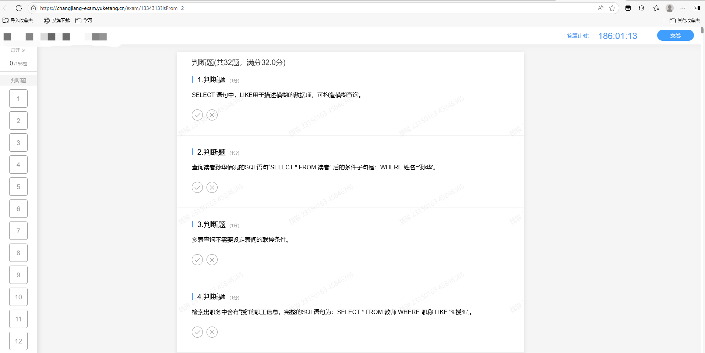
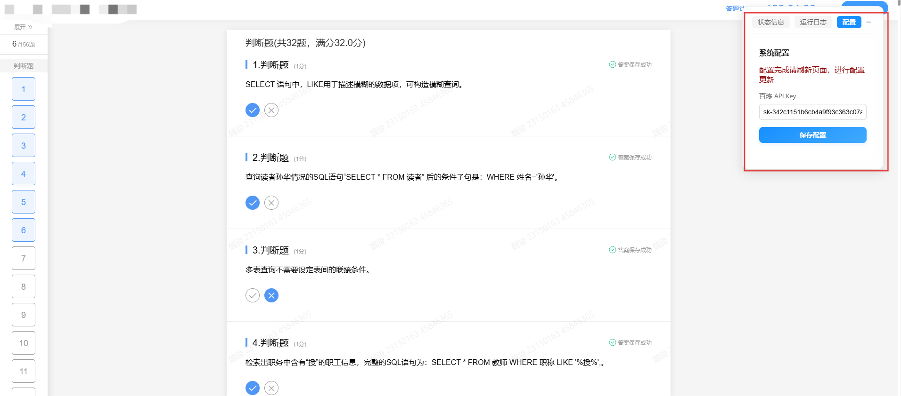
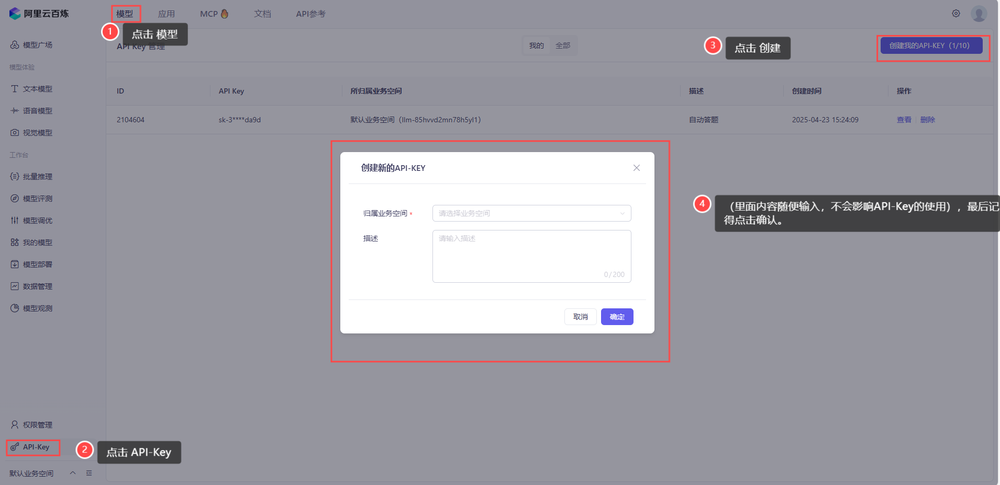
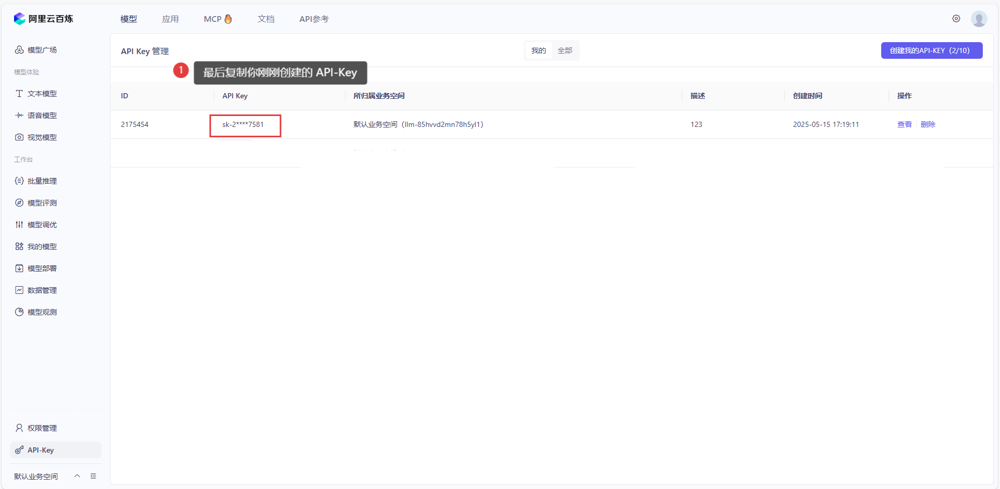
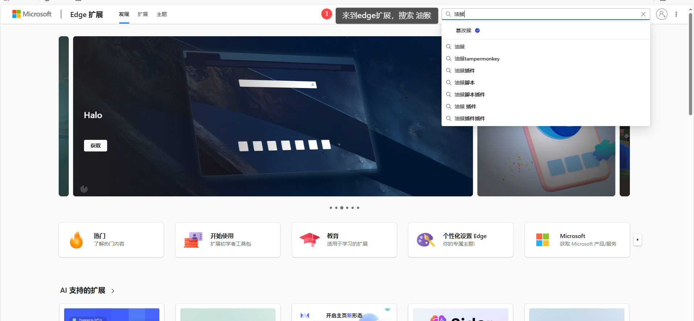
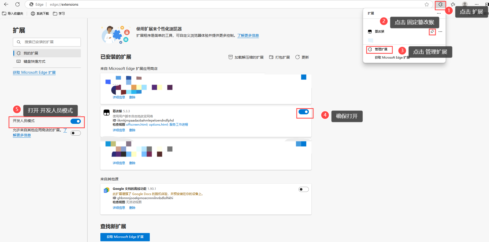
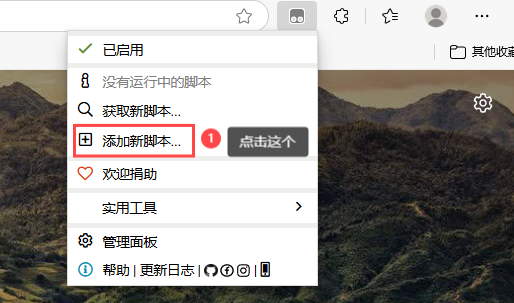
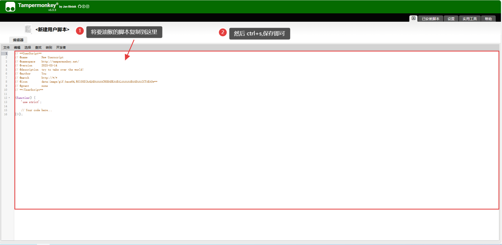

# AI自动答题 （无需搭建本地后端）BOTTOOLS        
- frontend 文件里面的 non_backend （无后端）文件

- 支持多个在线教育平台的自动答题脚本
  - 雨课堂
  - 英华在线       
 
- 需要在浮窗配置自己的 百炼API_KEY
           
- 如需修改调用模型直接去 __代码893行__ 切换模型（默认使用 qwen-plus）

### 使用方法
1.添加脚本到油猴，打开油猴，
2.进入到指定页面（如果到指定页面脚本没出现，刷新页面即可），在浮窗配置好 API_Key，刷新页面,就可自动做题。

3. __在英华平台的 课程页面 或者 做题页面 ，脚本才会启动__

        
4. __访问雨课堂的页面，脚本才会启动__


5.__在这里配置API_Key__

                                                                        
## ---------------------------------------------------------------------------------------------------------------------------------------------------------------------------------------------------------------------------------------


### 如何获得百炼API_KEY
- 第 1 步 进入 __百炼官网__ https://bailian.console.aliyun.com/
                  

- 第 2 步 __进行登录和实名认证，可领取他的免费额度__
           

- 第 3 步 __记得实名认证，才能开通模型服务__
                   


                              

- 第 4 步


                                     
## ---------------------------------------------------------------------------------------------------------------------------------------------------------------------------------------------------------------------------------------

   
### 如何使用 Tampermonkey浏览器插件 （油猴插件）以 edge浏览器 为例
- 第 1 步
  
 

- 第 2 步
  
 

- 第 3 步
  
 

- 第 4 步
  
 

- 第 5 步

 

- 第 6 步
  
 

- 第 7 步 __将frontend文件夹里面的js脚本，复制到这里__
  
 

## ---------------------------------------------------------------------------------------------------------------------------------------------------------------------------------------------------------------------------------------
## ---------------------------------------------------------------------------------------------------------------------------------------------------------------------------------------------------------------------------------------
  

# AI自动答题（需要搭建后端）BOTTOOLS

### 1.项目介绍
这是一个基于前后端分离架构的智能题库系统，包含多平台自动答题脚本和智能答案查询API服务。系统支持多种AI模型（火山引擎/阿里百炼/硅基引擎）自动回答问题，并提供高效的答案缓存和查询服务。

> 如需英华刷课去这个链接 https://github.com/aoaostar/mooc/releases/tag/v1.3.2

### 2.环境要求
- Tampermonkey浏览器插件
- （也可无需自己搭建后端使用 https://zerror.neoregion.cn/ 的软件或者在线题库也行）
- Python 3.8+
- MySQL 5.7+（可选，支持无数据库模式）
- Node.js（前端脚本开发）

## 前端
- 支持多个在线教育平台的自动答题脚本
  - 雨课堂
  - 英华在线
- 基于Tampermonkey的浏览器插件形式

### 1.使用方法
1. 安装Tampermonkey浏览器扩展
2. 添加此脚本到Tampermonkey
3. 修改脚本的url,url格式如下：
```bash
url: `http://127.0.0.1:5000/api/query?title=${encodeURIComponent(question)}&options=${encodeURIComponent(JSON.stringify(options))}&type=${encodeURIComponent(type)}`,

```

> url可以支持ocs和ze提供的题库url
在url里面加入token就行：
```bash
url: `https://api.zaizhexue.top/api/query?token=12345678910&title=${encodeURIComponent(question)}&options=${encodeURIComponent(JSON.stringify(options))}&type=${encodeURIComponent(type)}`，

```  
4. 访问英华平台的课程页面
   
5. 脚本会自动运行做题并在页面右上角显示浮动窗口

### 2.脚本可能存在的问题
- 可能在点击的时候，没有添加的延时的原因，可能会跳过一些题，但是到最后都会去完成的
- 可能存在 “完成作业” 提交不上去的问题，进行 __网页刷新__ 即可解决

## 后端
- 后端主要提供获得答案功能，如果觉得配后端麻烦，可以使用 https://zerror.neoregion.cn/ 提供的免费ai查询软件，或者使用他的在线题库（直接替换url就行了）。
- 主要是参考 https://github.com/Miaozeqiu/ai-ocs-question_bank ，自己也就稍微修改了一下地方。
- 基于Flask的RESTful API服务
- 多AI模型集成（火山引擎/阿里百炼/硅基引擎）
- MySQL数据库缓存答案
- 支持有数据库和无数据库两种部署模式
  
### 1.功能特点
- 多平台支持：适配多个在线教育平台
- 多题型支持：处理单选题、多选题、判断题和填空题
- 智能答题：集成多个AI模型，提供准确的答案
- 高效缓存：MySQL数据库缓存历史答案
- RESTful API：标准的API设计，易于集成
- 跨域支持：支持跨域请求，方便前端调用

### 2.快速开始

- 在 `backend` 文件里面也有

### 错误码说明
- 0: 成功
- 1001: 参数错误
- 1002: 系统错误
- 2001: 未找到答案

### 后端使用下来基本没什么问题

# 注意事项
- 本脚本系统仅供学习和研究使用
- 使用脚本可能违反教育平台的使用条款
- 使用过程中请遵守学术诚信原则

# 免责声明
本脚本仅作为技术研究和学习用途，使用者应自行承担使用脚本可能带来的一切后果。作者不对因使用此脚本而可能产生的任何问题负责
