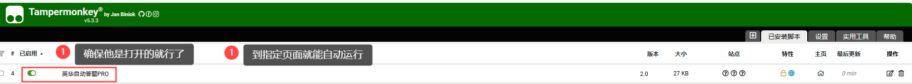

# AI自动答题系统 BOTTOOLS

***

> 如需英华刷课点击这个链接 https://github.com/aoaostar/mooc/releases/tag/v1.3.2 （使用方法可以通过点击目录跳转查看）

***

## 目录
- [项目简介](#项目简介)
- [功能特点](#功能特点)
- [使用方法](#使用方法)
  - [脚本运行逻辑](#脚本运行逻辑) 
  - [脚本使用方法](#脚本使用方法)
  - [有后端使用方法](#有后端使用方法)
- [环境要求](#环境要求)
- [安装教程](#安装教程)
  - [安装油猴插件和脚本添加-以edge浏览器为例](#安装油猴插件和脚本添加-以edge浏览器为例)
  - [获取百炼api_key](#获取百炼api_key)
- [常见问题](#常见问题)
- [刷课脚本使用方法](#刷课脚本使用方法)
- [注意事项](#注意事项)
- [开源协议](#开源协议)

***

## 项目简介
支持多个在线教育平台的自动答题系统，包括 雨课堂 和 英华在线 等平台。提供两种使用方案：无后端直接使用和自建后端部署。

***

## 功能特点
- 多平台支持
  - 雨课堂
  - 英华在线
- 多种部署方案
  - 无后端方案（使用百炼API）
  - 自建后端方案（支持多种AI模型,mysql数据库存储）
- 智能答题功能
  - 支持多种题型
  - 高效答案缓存
  - 准确的答案匹配

***

## 使用方法
### 脚本运行逻辑
1. 英华学堂刷题
 - 自动查找进入课程页面的测试章节（硬编码查找），在测试章节里面进行自动答题答题逻辑。
2. 雨课堂刷题
 - 到作业页面，进行一次循环（无论做没做过）他都会通过问题，然后来选择选项。

### 脚本使用方法
1. 安装油猴插件  
2. 导入脚本  
3. __进入 课程页面 或者 做题页面 即可使用__ 


4. __访问雨课堂的页面，脚本才会启动__

5. __配置百炼API_KEY__

6. 到指定页面自动开始使用

### 有后端使用方法
1. 部署后端服务
2. 安装油猴插件
3. 配置API地址
```bash
url: `http://127.0.0.1:5000/api/query?title=${encodeURIComponent(question)}&options=${encodeURIComponent(JSON.stringify(options))}&type=${encodeURIComponent(type)}`,

```
4. 到指定页面自动开始使用

***

## 环境要求
- Tampermonkey 浏览器插件
- Python 3.8+（后端部署需要）
- MySQL 5.7+（可选）
- Node.js（前端开发需要）

***

## 安装教程
### 安装油猴插件和脚本添加-以edge浏览器为例
- 第 1 步
 
- 第 2 步
 
- 第 3 步
 
- 第 4 步
 
- 第 5 步

 
- 第 6 步
 
- 第 7 步 __将frontend文件夹里面的js脚本，复制到这里__


***

### 获取百炼api_key
- 第 1 步 进入 __百炼官网__ https://bailian.console.aliyun.com/
- 第 2 步 __进行登录和实名认证，可领取他的免费额度__
- 第 3 步 __记得实名认证，才能开通模型服务__

- 第 4 步


***

### 3. 部署后端
- 在backend文件有说明

***

## 常见问题
1. 未正常完成作业提交
   - 解决方案：刷新网页后重试
2. 雨课堂做题无论什么情况重新运行就是重新做一次题

***

## 刷课脚本使用方法
- 第 1 步 点击链接 https://github.com/aoaostar/mooc/releases/tag/v1.3.2 ，根据自己的配置下载 


- 第 2 步 下载解压缩打开文件 （以windos为例），点击 config.json 文件进行配置 

.png)

- 第 3 步 根据图片修改一下配置，base_url 为需要刷课的网址， username 为账号， password 为密码， 根据自己情况配置 


- 第 4 步 点击 运行 即是运行， 结束， 即是结束。 

.png)

***

## 注意事项
- 本项目仅供学习和研究使用
- 使用时请遵守学术诚信原则
- 请遵守相关平台的使用条款

## 开源协议
本项目采用 MIT 协议开源，详细信息请参阅 LICENSE 文件。

## 免责声明
本脚本仅作为技术研究和学习用途，使用者应自行承担使用脚本可能带来的一切后果。作者不对因使用此脚本而可能产生的任何问题负责。
